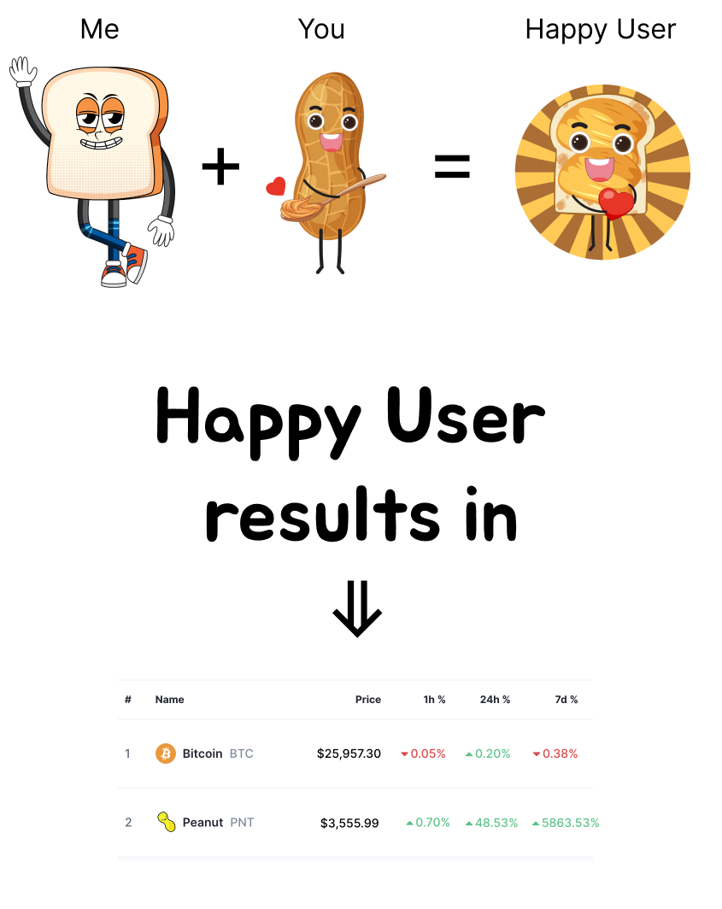

# peanut-cv

# Hello 👋

I see that you're so funny guys, so I hope you will smile of the picture above :) 

Let me introduce myself and tell you why I'm the best fit for your front-end Engineer. 

I was a 15-year-old dude with a big dream of becoming a pilot, but my health dashed those hopes. Then, on January 1, 2010, at 1:00 AM, the worst happened - I got banned from my all-time favorite online game. That's when I thought, "Screw it, I'll create my own game and be the admin so no one can ban me anymore!" 😄

I tried to get some hacked game sources and launch them, but these weird MySQL and PHP errors just drove me crazy. So, I said to myself, "Forget this, I'm gonna learn programming!"

Over the next year, I dived headfirst into learning JavaScript and PHP to create a tactical multiplayer game. Eventually, I even churned out a few games for the Russian social network vk.com (Glory to Ukraine!).

But here's where things got interesting. I was just a 16-year-old kid from a humble background who realized, "Hey, I can make some good money from this!" It felt like my ticket to independence. 😎

# That's When My Decentralized Journey Started
In 2017, I hopped on the crypto train, and my first stop was BTS (Bitshares Decentralized Exchange). It was mind-blowing! I learned that crypto and blockchain aren't just about digital money; they're about building a decentralized society.

(If you're scratching your head about what BTS is, it's like a super cool blockchain thing based on graphene with DPoS consensus. In a nutshell, it lets folks create their own DEXes, brand them however they want using BTS open source code UI, and launch their trading pairs. All network fees go into a fee pool and get distributed among worker contracts that help grow the BTS network.)

I was part of the UI team, and it hit me hard that blockchain projects were built by developers and weren't exactly user-friendly.

So, I set a personal goal to jazz up the bitshares UI/UX in the coming years, and I made some serious progress. But then, the crypto crisis in late 2018 smashed my dreams because we ran out of funds. 😔

#Trying My Hand at Startups
I launched a startup for EOS blockchain next, all about tracking project tokens' prices and business data. It was supposed to help potential investors understand what's going on behind the token – stuff like users retention, whale movements, ROI, you name it (for dapps who share their revenue between token holders). 
Long story short, I crashed and burned, but I learned a vital lesson: always size up the market and weigh costs against revenue before jumping in. 📉

Then came my next project: a gambling dApp. I had to throw in the towel eventually because of the technical nightmares with EOS blockchain (to be honest, it's a bit of a hot mess and practically dead right now - impossible to build anything cool on that pile of junk). 😩

#Now, in the Present
Fast forward to today, and I've got a few projects in the pipeline:

There's a crypto 2D game (more like a side hobby). I'm planning to release my first complete, awesome game. Beta testing's in the works for Android/iOS markets, without any PlayToEarn or blockchain stuff – just to test the game idea before taking the next step.

Then there's a private analytics dashboard for traders. Binance doesn't give me the data I need, and I've noticed that all the commercial dashboards out there suck when it comes to UX. So, my plan is to make my own and maybe even sell it to folks who appreciate top-notch UX. I'm currently diving into trading and studying economics to make this a reality.

# What I'm Hunting For
I'm on the hunt for a job that gets my heart racing. For the past six years, I've been deep in the startup scene (mostly blockchain-based). Nothing beats the feeling of seeing my work translate into real business profit – user feedback, those numbers, revenue, you name it. I want to be part of the engine that makes a product awesome and successful in the business world.

#  Why I'm Your Perfect Fit
Now, you might wonder why I'm the ideal candidate. Sure, I might not have kept up with the latest and greatest in EVM infrastructure over the past year, and there are some libraries you use that I'm not too familiar with.

But here's the deal: I'm a quick learner with a business-oriented mindset. I can find that sweet spot between delivering speed (we're talking lightning-fast) and nailing the architecture (making it scalable).

But all this is pointless if the product doesn't ignite my passion, and I don't believe in its success. I'm not just here for the paycheck; I'm here to make a difference.

As for those test assignments to snag a job, well, screw that. But when it comes to your product, I'm all in. I'm willing to invest my time, even in a hackathon, just to see if my way of thinking and approaches align with your vision. It's like Tinder for business – let's match! 😄

